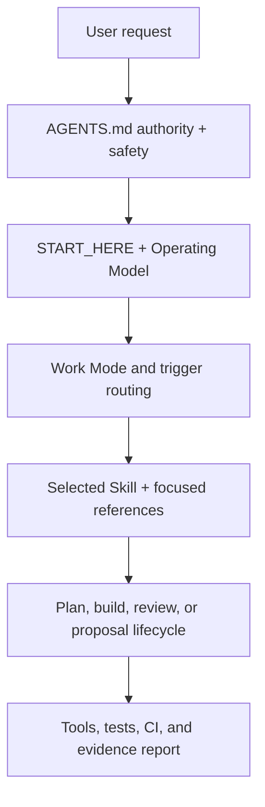

# Base Structure, Skill Routing, and BCP Conflict Recovery Audit

- Audit date: 2026-08-11 UTC
- Audited baseline: `ee8227d1aeae8e159ea2f9c4ba71bb0ff9e4349a`
- User work order: `Base_자동진화_통합_Work_작업지시서_V2.3.md`
- Scope: current Base canon, active Skill/work routing, validators, recent PRs, BCP-021 through BCP-025 collision history, and current external practice
- Result: one documentation provenance repair; no new Skill, dependency, Registry entry, or broad workflow change

## Executive verdict

Base is structurally coherent and its primary contracts are already aligned with current agent-engineering practice: a bounded repository instruction entrypoint, selective Skill loading, explicit authority precedence, proposal/implementation separation, source-backed validation, and small PR boundaries.

The audit found two confirmed provenance losses across one GRIMOIRE proposal's repeated collision rebuilds. They did **not** occur in current BCP-023. Current BCP-023 is the Ten Paces proposal and its body remained byte-identical from its first PR #298 proposal commit through current `main`. The GRIMOIRE proposal temporarily used BCP-023 in PR #295 and later became current BCP-024, but the two facts disappeared at different transitions:

1. The transient external HTTP 525 followed by a successful same-exact-head Star Runtime POC rerun existed in PR #293's BCP-022 and was already absent by PR #295's BCP-023.
2. Decision `GM-GODOT-AUTHORING-GUT-TEST-AUTHORITY-01` remained through PR #296 and disappeared in PR #297's final BCP-024.

Both facts were restored to current BCP-024. A regression test now checks reciprocal source separation between current BCP-023 (Ten Paces) and current BCP-024 (GRIMOIRE) and requires the explicit collision-recovery audit; it does not promote the project-only facts into an approved Base implementation contract.

## Repository inventory

| Surface | Current count or size | Audit interpretation |
|---|---:|---|
| Tracked files | 851 | Large enough to require owner/consumer routing rather than load-all review. |
| ACTIVE Skill packages | 30 | Registry-backed, trigger-selected; no count target was imposed. |
| Tracked files under `tests/` | 128 | Broad executable contract surface. |
| Tracked files under `tools/` | 41 | Deterministic validation and artifact generation are separated from prose rules. |
| Root `AGENTS.md` | 18,296 bytes | Below Codex's documented default 32 KiB combined project-instruction limit. |
| Total ACTIVE `SKILL.md` bodies | 307,763 bytes | Too large for eager loading, but Base explicitly uses selective trigger routing and references. |
| Registered BCPs | 25 | Current Registry validates with no duplicate ID or missing proposal body. |
| Broken internal Markdown link candidates | 0 | Every tracked relative Markdown target resolved after excluding URLs, anchors, and explicit placeholders. |
| Invalid tracked JSON documents | 0 | All tracked JSON parsed successfully. |
| Symlinks / tracked files over 500 KiB | 0 / 0 | No hidden link escape or unexpectedly large tracked artifact was found. |
| Exact duplicate non-empty file groups | 1 | The two self-contained Godot pilot examples intentionally carry the same `.gitignore`; this is an allowed example boundary, not duplicate authority. |

The phrase “review all of Base” was executed as a repository-wide owner/consumer audit: canonical entrypoints, Registry, Skill packages, documentation map, generated consumers, tools, tests, workflows, BCPs, and recent Git/PR history were mapped. It was not interpreted as injecting all 851 files into one model context.

## Canonical work structure

### Authority and context layers

| Layer | Canonical owner | Responsibility | Conflict rule |
|---|---|---|---|
| User intent | latest user instruction | goal, scope, approvals, protected boundaries | Highest task-local authority. |
| Repository operation | `AGENTS.md` | precedence, planning level, safety, completion contract | Project-local canon outranks Base defaults. |
| Human entrypoint | `START_HERE.md` | minimal read order and route discovery | Does not duplicate detailed procedures. |
| Explanatory model | `docs/OPERATING_MODEL.md` | lifecycle, owners, state axes, evidence meaning | Explanatory; executable owners remain Skills/tools/tests. |
| Skill routing | `skills/SKILL_REGISTRY.json`, `docs/WORK_MODE_AND_SKILL_ROUTING.md` | primary/supporting Skill selection and non-selection | Trigger-based, not load-all. |
| Task execution | selected `skills/*/SKILL.md` and focused references | bounded procedure, inputs, outputs, quality gates | Existing Solution First; one owner per responsibility. |
| Verification | `tools/`, `tests/`, `.github/workflows/` | deterministic checks and current evidence | Skips and unavailable layers remain explicit. |
| Base change governance | `[수정제안서]/**` | proposal lifecycle, approval, implementation linkage | Proposal PR and active implementation PR remain separate. |

### Current Skill architecture

The Registry has 30 ACTIVE Skills. The important structural property is not the number but the ownership boundary:

- `managing-project-intake-and-work-contract` owns route/clarify/contract/execution-report.
- `running-adversarial-review-and-refinement` owns attack, critique validation, approved refinement, and regression recheck.
- `reviewing-and-validating-project-changes` owns validation lenses and evidence verdicts.
- `auditing-canonical-reference-freshness` owns impact maps, stale references, derivative freshness, and propagation gaps.
- `evolving-project-discipline-skills` owns consolidation-first Skill evolution and behavior coverage.
- `managing-base-change-proposals` owns BCP extract/submit/review/implement/verify.

No new BCP-concurrency Skill was added. No persisted independent behavior-evaluation result demonstrates a routing failure, and the responsibility already belongs to `managing-base-change-proposals` plus final PR validation. Session-only exploratory controls informed brainstorming but were not captured as formal model-evaluation evidence, so this audit classifies them as `MODEL_RUN_STATUS: NOT_RUN` rather than a formal PASS. Adding guidance without a reproducible gap would increase context cost and violate Base's consolidation-first boundary.

## External benchmark comparison

| Current external practice | Base status | Decision |
|---|---|---|
| Codex loads `AGENTS.md` from repository root toward the working directory, with closer instructions overriding earlier ones; the documented default combined project-doc limit is 32 KiB. [OpenAI agent configuration](https://learn.chatgpt.com/docs/agent-configuration/agents-md) | Root entrypoint is 18,296 bytes and delegates detail to lower-level owners. | Keep. No root expansion. |
| Codex repository Skills use progressive discovery and repository-local `.agents/skills`; duplicate names do not merge. [OpenAI build skills](https://learn.chatgpt.com/docs/build-skills) | Base has one active Skill Registry and a project adapter/template path rather than duplicate active owners. | Keep selective routing; do not mirror the same Skill body into multiple active paths. |
| OpenAI recommends keeping mandatory repository instructions small and moving specialized detail into Skills. [OpenAI production skill integration](https://developers.openai.com/blog/skills-agents-sdk) | Base already routes detailed procedures to selected Skills/references. | Keep; target large individual Skill bodies only when a concrete retrieval failure appears. |
| Skill evaluation should distinguish outcome, process, style, and efficiency while keeping must-pass criteria small. [OpenAI skill evaluation](https://developers.openai.com/blog/eval-skills) | Base separates behavior fixtures, coverage, implementation evidence, current test status, and independent model results. | Keep; do not claim model-run success when result artifacts are absent. |
| Codex review rules should protect consequential, non-obvious invariants; test one violation, one safe counterexample, and one unrelated change, while leaving deterministic checks to CI. [OpenAI custom code review rules](https://developers.openai.com/blog/custom-code-review-rules-for-codex) | Base already keeps durable invariants in `AGENTS.md`, specialized judgment in Skills, and deterministic enforcement in tests. The recovered BCP lineage, however, was only protected by a section-heading assertion. | Absorb the learning in the focused lineage regression: assert the recovered evidence and non-approval boundary without duplicating new root prose. |
| GitHub supports repository-wide and path-specific custom instructions, and both may apply. [GitHub custom instructions](https://docs.github.com/en/copilot/how-tos/copilot-on-github/customize-copilot/add-custom-instructions/add-repository-instructions) | Base distinguishes root authority from path/project adapters. | Keep; continue conflict checks when adding path-specific instructions. |
| Small, self-contained changes are easier to review, test, and roll back. [Google small changes](https://google.github.io/eng-practices/review/developer/small-cls.html) | Proposal-only BCP PRs and separate implementation PRs already enforce small logical changes. | Keep this repair as one lineage-focused change. |
| A merge queue validates against the latest target and requires `merge_group` workflow support. [GitHub merge queue](https://docs.github.com/en/repositories/configuring-branches-and-merges-in-your-repository/configuring-pull-request-merges/managing-a-merge-queue) | Base currently relies on final fresh-read/rebuild rather than a merge queue. | Do not introduce a queue in this repair; it is repository governance, not a documentation bug fix. Evaluate only if collision frequency remains material. |
| Required checks are commit-identity-sensitive, and skipped jobs can report success. [GitHub status checks](https://docs.github.com/en/pull-requests/reference/status-checks) | Base records exact validation identity and does not promote unavailable runtime layers to PASS. | Keep; continue separating applicable PASS from skipped/unavailable layers. |

## BCP-021 through BCP-025 collision audit

### PR lineage

| PR | Proposal identity at that PR | Outcome | Collision handling |
|---:|---|---|---|
| [#291](https://github.com/alsdmlals4-eng/Base/pull/291) | BCP-021, ninja-survival CI source fidelity | Merged as `d7dedbc...` | Occupied 021 first. |
| [#292](https://github.com/alsdmlals4-eng/Base/pull/292) | BCP-021, urban-legend content-identity gate | Closed unmerged | Rebuilt own proposal; did not edit #291. |
| [#293](https://github.com/alsdmlals4-eng/Base/pull/293) | BCP-022, GRIMOIRE authority split | Closed unmerged | Final race found #294 using 022. |
| [#294](https://github.com/alsdmlals4-eng/Base/pull/294) | BCP-022, urban-legend content-identity gate | Merged as `be2435b...` | Preserved BCP-021; released its temporary 023 allocation. |
| [#295](https://github.com/alsdmlals4-eng/Base/pull/295) | BCP-023, GRIMOIRE authority split | Closed unmerged | Second ID race; later descendant is BCP-024. |
| [#296](https://github.com/alsdmlals4-eng/Base/pull/296) | BCP-024, GRIMOIRE authority split | Closed unmerged | Base advanced; stale Registry snapshot was not merged. |
| [#297](https://github.com/alsdmlals4-eng/Base/pull/297) | BCP-024, GRIMOIRE authority split | Merged as `449b83c...` | Rebuilt from current main and preserved 021/022. |
| [#298](https://github.com/alsdmlals4-eng/Base/pull/298) | BCP-023, Ten Paces retained-instance recovery | Merged as `596e60f...` | 023 was free on current main; BCP-024 preserved. |
| [#299](https://github.com/alsdmlals4-eng/Base/pull/299) | first BCP-023, final BCP-025, OMENWARD runtime isolation | Merged as `ee8227d...` | First head invalidated after #298; own delta rebuilt as 025. |

The Registry's current tail order is 021, 022, 024, 023, 025 because it records merge sequence, not numeric sorting. IDs and paths remain unique, and the validator accepts all 25 entries.

### Content-integrity evidence

| Lineage | Evidence | Verdict |
|---|---|---|
| urban-legend old 021 → current 022 | Direct Git blob diff shows only `proposal_id` changed between PR #292 and current proposal body. | No content loss found. |
| Ten Paces current BCP-023 | SHA-256 `fd9feffc74e632f4612428d972b833e8fdb8569880b9bac40b8c94e24e29385f` at commits `7910c195`, `811b65b6`, `7995aa20`, merge `596e60f5`, and audited `main`. | Byte-identical; no loss and no repair to current BCP-023. |
| GRIMOIRE old 022 → old 023 → current 024 | Direct blobs were available from PR #293, #295, #296, and #297. HTTP 525/Star Runtime disappeared between #293 and #295; the Decision ID disappeared between #296 and #297. | Two distinct omission transitions confirmed and recorded; both provenance facts repaired in current BCP-024. |
| OMENWARD first 023 → current 025 | PR #299 body records that the first head used 023 and was invalidated after #298; the visible final branch contains only the rebuilt 025 commit. The overwritten first-head blob is not present in fetched refs. | Allocation recovery is verified; byte-for-byte old-head content equality remains unverified. Do not invent a PASS. |

### GRIMOIRE omission classification

| Earlier fact | Current-state classification | Action |
|---|---|---|
| `GM-GODOT-AUTHORING-GUT-TEST-AUTHORITY-01` | Present in PR #293/#295/#296; absent in PR #297/current BCP-024 | Restored under project-specific values. |
| transient external HTTP 525, then same-head Star Runtime POC success | Present in PR #293's BCP-022; already absent in PR #295's BCP-023 and later versions | Restored in Project Application/Verification and attributed to the earlier BCP-022 source. |
| exact Windows worktree path, branch, partial local SHA, port ranges, token-wrapper detail | Project-local implementation detail; final proposal preserves the categories and exact tool versions but not every local value | Not restored. Keeping stale or machine-specific values would not strengthen the reusable Base proposal. |
| expanded prose around the eight receipt rules | Semantically retained in a shorter rule set | No change. |
| explicit write-capable alternate channel wording | Retained through the approved-capable-channel and final-write freshness rules | No change. |

## Implemented repair

1. Added `test_reallocated_bcp_lineage_keeps_distinct_sources_and_recovery_audit` to `tests/test_base_change_proposals.py`.
2. Watched the first regression fail on missing provenance, then tightened it after review and watched it fail on the missing explicit collision-recovery audit.
3. Restored the exact Decision identifier and same-head HTTP 525/Star Runtime recovery statement to current BCP-024, with their distinct loss transitions.
4. Strengthened the regression to inspect only the collision-recovery audit slice and require the Decision ID, HTTP 525, Star Runtime, PR #293/#295/#296/#297 lineage, `SUBMITTED` state, null approval, and `NOT_GRANTED_IN_THIS_STAGE` implementation boundary.
5. Mutation-checked the strengthened assertion: removing the Decision ID from the recovery audit caused the focused test to fail; restoring it returned the test to green.
6. Re-ran the focused test, all BCP tests, and the BCP validator.

This repair does not approve or implement the substantive BCP-024 proposal. Its lifecycle remains `SUBMITTED`, `approval_ref=null`, and `base_implementation_authority=NOT_GRANTED_IN_THIS_STAGE`.

## Adversarial review

| Finding | Severity | Resolution |
|---|---|---|
| Numeric ID alone can point to different proposal lineages during a race. | P1 | Tests and audit use source project + slug + PR/commit lineage, never numeric slot alone. |
| Adding recovered GRIMOIRE text to current BCP-023 would contaminate Ten Paces evidence. | P1 | Current BCP-023 is asserted to contain Ten Paces and exclude GRIMOIRE. |
| Broad Skill edits could be justified by the incident without persisted behavior evidence. | P1 | No registered failing behavior result and no independent owner boundary; no Skill change. Session-only exploration is `NOT_RUN`, not PASS. |
| A hardcoded full-document hash could make harmless edits painful. | P2 | The regression asserts semantic provenance markers and project separation; the audit records hashes as evidence only. |
| Merge queue adoption could be over-prescribed from one burst of proposal traffic. | P2 | Deferred as repository governance; current rebuild/final-race contract worked. |
| Historical rewritten PR refs may be unavailable after force-push/rebuild. | P2 | Evidence limits are recorded; unavailable blobs remain UNVERIFIED. |
| The original lineage regression could pass after the restored facts were removed as long as the audit heading remained. | P1 | The test now checks the recovered markers inside the audit slice and verifies that proposal approval/implementation authority did not change. |

## Before and after

| Concern | Before | After | Measured effect |
|---|---|---|---|
| BCP-023 interpretation | Numeric ID could be mistaken for the older GRIMOIRE draft. | Source project, slug, PR lineage, and byte-identical Ten Paces body distinguish current BCP-023 from the former slot occupant. | Cross-project contamination is rejected by the focused test. |
| BCP-024 provenance | Two source facts were absent after separate rewrite transitions. | Both facts and their distinct loss points are restored without changing `SUBMITTED` or implementation authority. | Proposal validation remains green; provenance is reviewable from the current file. |
| Regression strength | Section-title presence protected structure but not the recovered evidence itself. | The audit slice must retain both markers, four PR transitions, and the non-approval boundary. | A deliberate Decision-ID deletion now fails the focused test and restoration passes. |
| Skill/work structure | A new concurrency Skill or expanded root rule set was a tempting response. | Existing BCP, adversarial-review, validation, and freshness owners remain unchanged. | ACTIVE Skill count remains 30 and total Skill-body context remains 307,763 bytes; no new routing competition was introduced. |
| Repository integrity evidence | Main validation covered contracts, but the audit did not separately report link/JSON/duplicate/size inventory results. | The tracked inventory explicitly records zero broken relative links, zero invalid JSON, zero symlinks/large artifacts, and one classified example duplicate. | The “whole repository” claim now has concrete inventory ceilings and false-positive classification. |

The improvement is therefore not inferred from more prose or a higher Skill count. It is demonstrated by a previously surviving mutation that now fails, unchanged green repository validation, and no increase in active routing surface.

## Validation receipts

### Baseline before changes

- BCP validator: 25 proposals validated.
- Local validation: 1,193 tests, `OK`, 35 skips.
- Required CI topology check: PASS.
- Base v9 generated artifacts: current.
- Base v9 integrity: PASS.
- Skill-system coverage: PASS.
- `git diff --check`: PASS.
- `git fsck --strict`: PASS.

The 35 baseline skips were environment/capability layers such as unavailable Godot 4.7 runtime, Windows-only checks, and publication font/Poppler conditions. They were not reported as runtime PASS.

### Focused repair validation

- RED: lineage regression failed on missing `GM-GODOT-AUTHORING-GUT-TEST-AUTHORITY-01`.
- GREEN: focused lineage regression passed after restoration.
- HARDENING RED: deleting the Decision ID only from the collision-recovery audit made the strengthened focused test fail.
- HARDENING GREEN: restoring the exact audit marker made the strengthened focused test pass.
- All BCP tests: 13 passed.
- BCP validator: 25 proposals validated against baseline `ee8227d...`.

### Final validation after repair

- Local validation: 1,194 tests, `OK`, 35 skips.
- Local fallback CI gate: PASS.
- Required CI gate topology: PASS.
- Base v9 generated artifacts: current.
- Base v9 integrity: PASS against trusted baseline `ee8227d...`.
- Skill-system coverage: PASS.
- `git diff --check`: PASS.
- `git fsck --strict`: PASS.

The added lineage regression accounts for the increase from 1,193 to 1,194 tests. The same 35 environment/capability skips remain explicit.

## PR check status

At the final fresh-read snapshot:

- remote `main`: `ee8227d1aeae8e159ea2f9c4ba71bb0ff9e4349a`;
- open Base PRs: 0;
- local audited base vs fetched `origin/main`: behind 0, ahead 0 before any local commit;
- PR #291, #294, #297, #298, and #299: merged;
- PR #292, #293, #295, and #296: closed unmerged;
- current work: local branch only, with no commit, push, or PR mutation performed.
- current local branch has no remote PR, so mergeability, review-thread count, and remote required-check status are `NOT_APPLICABLE_YET`;
- the connector returned no legacy status contexts or PR-triggered workflow runs for the already merged `main` SHA, so this audit does not fabricate a remote CI PASS from an empty response.

A final fresh read is still mandatory before any authorized push or PR creation. Local green evidence cannot prove future remote identity or mergeability.

## Final decisions

| Candidate | Decision | Reason |
|---|---|---|
| New concurrency Skill | REJECT | No independent boundary and no failing control behavior. |
| Expand BCP Skill body | REJECT | No reproduced behavior gap; context cost would rise. |
| Root `AGENTS.md` refactor | KEEP | Bounded size, correct authority chain, and detailed routing already delegated. |
| Load all Skills for every task | REJECT | Contradicts progressive disclosure and Base's own trigger policy. |
| BCP-023 text repair | REJECT | Current Ten Paces body is byte-identical and correct. |
| BCP-024 provenance repair | ACCEPT | HTTP evidence was present in old 022 and the Decision remained through old 023/024; both were absent from final 024 and their distinct loss points are recorded. |
| Registry sorting rewrite | REJECT | Merge-order tail is valid; a formatting rewrite would add conflict risk without semantic benefit. |
| Merge queue rollout | DEFER | Potential operational mitigation, but broader than this defect and requires governance/configuration work. |

## Follow-up triggers

Re-open structure changes only when evidence crosses one of these boundaries:

- a real routing/non-selection behavior evaluation fails;
- another BCP ID race causes semantic loss despite the current lineage test;
- collision frequency justifies a repository-level allocation mechanism or merge queue;
- root instruction aggregation approaches the configured project-doc byte ceiling;
- an individual large Skill causes measured discovery, correctness, or context-efficiency failure;
- current CI treats an inapplicable skipped layer as sufficient merge evidence.
