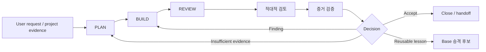

# Base v9 System Map

## Single operating path

This map describes one operating system. A stage may be compressed for a
low-risk, bounded change, but it may not skip its responsibility or pretend that
uncollected evidence exists.

각 단계는 실패 상태와 재개 조건을 남긴다. 실패한 검증을 통과로 바꾸지
않으며, 재개는 마지막으로 검증된 책임 원본과 증거에서 시작한다.

| Stage | Required input | Skill / mode selection | Responsible source | Output | Failure and resume condition |
| --- | --- | --- | --- | --- | --- |
| Request intake | Latest user instruction, repository context | Intake `route`, then `contract` when needed | User instruction and current canon | Scope, exclusions, verification contract | Missing material decision: record `USER_DECISION_REQUIRED`, then resume PLAN |
| PLAN | Approved scope, current canon, implementation facts | Primary discipline Skill plus minimum foundation Skills | Registered canonical docs and actual files | Approved plan, risks, acceptance criteria | Conflict or missing canon: repair or explicitly hold before BUILD |
| BUILD | Approved plan and protected boundaries | Build-capable Skill modes only | Approved contract plus changed files | Minimal implementation and propagated canon | Test or contract failure: return to the smallest relevant BUILD step |
| REVIEW | Diff, generated artifacts, tests, runtime evidence | Change validation / discipline review | Actual diff, tests, runtime evidence | `ACCEPT`, follow-up, revise, reject, or unverified decision | Insufficient evidence: mark `UNVERIFIED` and resume evidence collection |
| 적대적 검토 | Review output and assumptions | Adversarial attack, critique validation, regression recheck | Review evidence and stated assumptions | Validated findings only | Invalid critique: record `REJECTED_CRITIQUE`; valid finding returns to BUILD |
| 증거 검증 | Contract, final diff, required checks | Static, runtime, accessibility, performance modes as applicable | Test logs, CI, actual runtime evidence | Evidence report and gate decision | Failed or unavailable check: `FAILED`, `PARTIAL`, or `NOT_RUN`; do not overstate completion |
| Base 승격 후보 | Reusable lesson from a project or Base change | Base-change proposal / Skill evolution modes | Evidence-backed project lesson | Candidate, boundary, migration and adoption proposal | Project-specific detail or weak evidence: keep project-local or defer |

## Resume rule

Every interrupted task records its last verified stage, the responsible canonical
source, evidence location, unresolved decision, and next action. Resuming starts
from that recorded condition rather than reconstructing authority from chat
memory.
