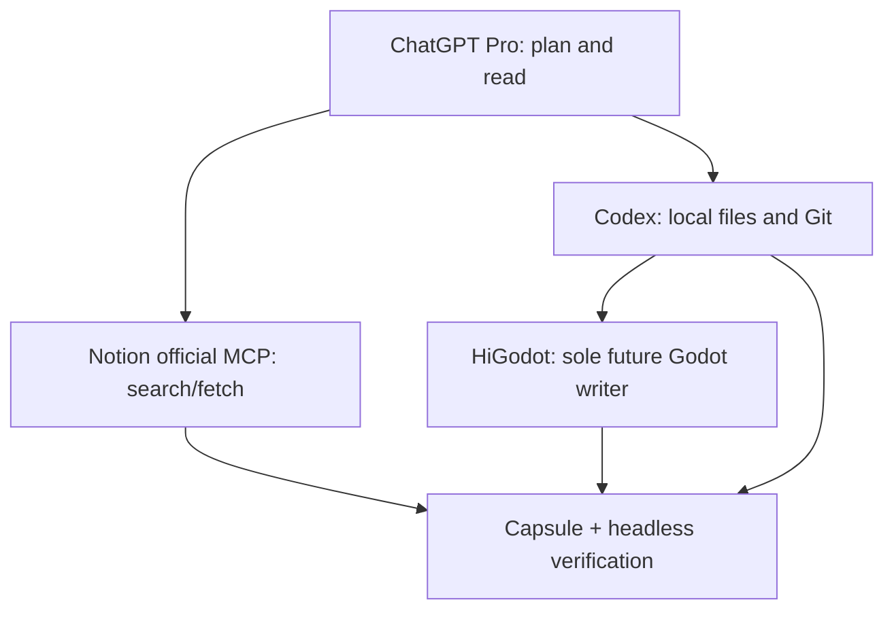

# Project Integration Capsule Design

## Status

- Decision: approved by the user on 2026-08-20
- Existing Solution First disposition: `REUSE + BIND`, not `BUILD_NEW_MCP`
- Scope: Base-side contract, template, validator, tests, and CI route
- Target project/Notion workspace mutation: not authorized by identity because no target was supplied

## Problem

The desired workflow lets GPT, Codex, Notion, and Godot inspect the same project and,
later, perform controlled changes. A single new `godot-gpt-codex-notion` MCP looks
convenient but duplicates capabilities already owned by Codex, Notion, and HiGodot,
creates a second Godot writer, expands credential and hosting cost, and cannot provide
full custom-MCP writes from the user's current ChatGPT Pro plan.

The Base-side problem is therefore narrower: bind one exact Git project, one Notion
project/record receipt, one Godot root, the existing Base adapter, and the existing
HiGodot adoption record without creating another authority.

## Current Base authority map

| Concern | Existing owner | Capsule action |
|---|---|---|
| Local files and Git | Codex native worktree + Git | verify exact identity and cleanliness |
| Human-facing project canon | Notion Project workspace | bind search/fetch receipt only |
| Structured/runtime canon | Project repository | bind commit and tracked evidence |
| Godot persistent authoring | `hi-godot/godot-ai` | reference adoption record; never write |
| Base release/project routes | `PROJECT_BASE_ADAPTER` | reference and hash; never duplicate |
| Runtime verification | Godot CLI/headless and project tests | future mutation gate, not claimed by v1 |

## Official benchmark and plan reality

| Option or fact | Official evidence | Consequence |
|---|---|---|
| ChatGPT custom full-MCP writes | [OpenAI developer mode guidance](https://help.openai.com/en/articles/12584461-developer-mode-and-full-mcp-connectors-in-chatgpt) says full MCP is Business/Enterprise/Edu; Pro custom MCP is read/fetch | GPT Pro cannot be the custom write plane |
| Codex MCP and local tools | [Codex MCP documentation](https://developers.openai.com/codex/mcp) supports local and remote servers; Codex already owns the local worktree | do not re-export local files through another MCP |
| Codex cost | [Codex pricing](https://developers.openai.com/codex/pricing) includes Codex in ChatGPT plans | use ChatGPT sign-in; do not add API-key billing |
| Notion integration | [Notion MCP](https://developers.notion.com/guides/mcp/overview) is hosted, OAuth-based, and supports workspace reads/writes | reuse official MCP; v1 restricts it to search/fetch receipts |
| Notion cost | [Notion pricing](https://www.notion.com/pricing) has a $0 individual Free plan and public API integrations | start on Free; do not require Notion AI credits |
| Godot integration | [HiGodot](https://github.com/hi-godot/godot-ai) exposes a broad live-editor MCP surface and lists Codex support | reuse it as the sole Godot authoring authority |
| Deterministic verification | [Godot command-line documentation](https://docs.godotengine.org/en/latest/tutorials/editor/command_line_tutorial.html) supports headless editor/CI execution | verify outside the authoring channel |
| MCP architecture | [MCP architecture](https://modelcontextprotocol.io/specification/2026-07-28/architecture) isolates multiple servers behind a host | prefer bounded servers over a monolith |

## Options compared

| Option | Goal fit | Cost | Authority risk | Operational load | Decision |
|---|---:|---:|---:|---:|---|
| One new monolithic MCP | medium | remote hosting plus possible plan upgrade | very high | high | reject |
| Custom API/Agents orchestrator | high in theory | metered OpenAI API plus hosting | high | very high | defer |
| ChatGPT Business + custom write MCP | high | new recurring seat cost | medium-high | high | upgrade trigger only |
| Modular local-first binding | high for current phase | zero incremental required | low | low | adopt |

## Selected architecture

The v1 Capsule has `authority: READ_ONLY_BINDING_NOT_CANON` and no write
allowlist. It references, rather than copies, `PROJECT_BASE_ADAPTER` and
`HIGODOT_ADOPTION_RECORD`. Codex direct Godot mutation and Notion existing-page
write are forbidden.

## Implementation Reality Gate

`READ_ONLY_BINDING_VERIFIED` means only that local, Git-tracked receipts and the
declared project identities agree. The validator checks:

- exact worktree top level, GitHub origin slug, local and origin-tracking base refs,
  branch, HEAD, base/result equality, and rollback equality;
- exact index/tree object identity, raw bytes for every tracked regular file without
  invoking repository clean filters, POSIX executable-mode identity, untracked files,
  narrowly allowlisted generated `.godot` cache, and `skip-worktree`/`assume-unchanged`
  visibility overrides;
- a blocking Finding when any required index, object, visibility, untracked, or ignored
  probe cannot execute or parse its result;
- fail-closed rejection of gitlink/submodule and tracked-symlink surfaces that v1 does
  not recursively verify, plus inherited `GIT_*` scrubbing and lazy-fetch-disabled Git
  reads for both project snapshots and canonical Base release pins;
- Decision, Base adapter, HiGodot adoption record, `project.godot`, and evidence
  existence at `result_sha`, canonical Base release-lock pins, hashes, and semantic
  cross-binding;
- one Project relation, deterministic Record Key, Revision, strict RFC3339 Last Edited,
  official Notion search/fetch receipt fields, and one writer canary receipt;
- a declared zero-incremental-cost policy that allows only GPT Pro, Notion Free,
  local OSS and optional included/free GitHub while prohibiting metered API/AI/hosting;
- one fixed local-binding Acceptance, exactly two supported receipts, their mapping,
  evidence levels, and the local ceiling.

It does **not** prove live Notion credentials, a post-fetch remote change, a running
Godot editor, HiGodot runtime health, production readiness, visual QA, or playtest.
Those remain `NOT_APPLICABLE`, `NOT_RUN`, or a later evidence level.

The v1 commit-identity schema deliberately accepts only 40-hex SHA-1 repositories.
SHA-256-format repositories fail closed and require a future version with 64-hex
identity, rollback, remote-ref, and fixture coverage rather than partial support.

The validator also does not prove the user's billing plan, quota, invoice, or remaining
Actions allowance. Cost is an adopted architecture policy, not runtime evidence.
The caller's required preflight fetch may update `.git` metadata; "read-only" here means
no product-file, Notion-page, or Godot-authoring mutation.

## Cost decision

Given the user's stated ChatGPT Pro plan and the cited current free tiers, the accepted
path is designed to require no new subscription:

- ChatGPT Pro sign-in for ChatGPT/Codex;
- Notion Free for the human-facing workspace;
- official hosted Notion MCP search/fetch where available;
- local Git, Python, Godot CLI/headless, and open-source HiGodot;
- GitHub free/included repository and Actions allowance where available.

Do not use an OpenAI API key for this path. API-key authentication and a custom
orchestrator are separately metered. Consider ChatGPT Business only when the user
needs ChatGPT itself—not local Codex—to execute custom MCP write actions.

## Upgrade triggers

Create a separate write-phase design only when all are true:

1. the exact project repository and Notion Project identity are supplied;
2. the user approves the mutation scope and recurring cost, if any;
3. HiGodot adoption and second-writer enforcement are real in that project;
4. Notion optimistic conflict detection and destination readback are executable;
5. Godot import/tests, rollback drill, and exact-head evidence can run.

Do not expand this v1 schema to smuggle in write authority.
